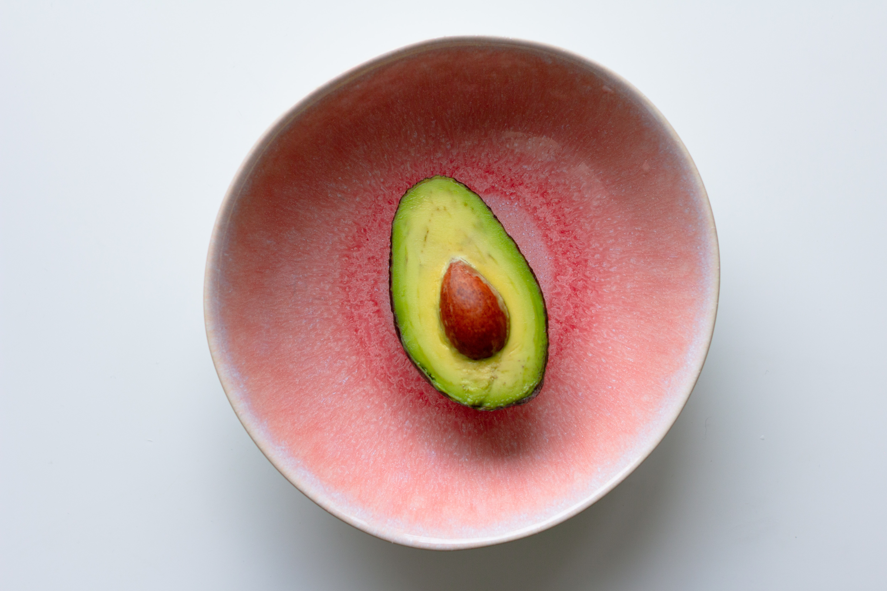

## What are the Fats?

Fats are one of the three main macronutrients, along with carbohydrates and proteins. They give to our bodies energy that is needed to work properly.

> "Fat molecules consist of primarily carbon and hydrogen atoms and are therefore are soluble in organic solvents and insoluble in water. Examples include cholesterol, phospholipids, and triglycerides. The terms lipid, oil, and fat are often confused. Lipid is the general term, though a lipid is not necessarily a triglyceride. Oil normally refers to a lipid with short or unsaturated fatty acid chains that is liquid at room temperature, while fat specifically refers to lipids that are solids at room temperature – however, fat may be used in food science as a synonym for lipid".

#### What are the types?

We have saturated fats, which might raise your LDL (bad) cholesterol level. These fats are solid at room temperature (they can be animal or plant origin). A big amount of LDL cholesterol puts you at risk for heart attack, stroke, and other major health problems. Thats why you should avoid or decrease food that is high in saturated fats.

Foods with a lot of saturated fats are animal products, such as butter, cheese, whole milk, ice cream, cream, and fatty meats. But also some vegetable oils, such as coconut, palm, and cocoa oil.

Then we have the unsaturated fats. These can help you to lower your LDL cholesterol. Most vegetable oils that are liquid at room temperature have unsaturated fats. Some examples are avocados, olives, walnuts fats, and vegetable oils like soybean, corn, canola, and olive oil. There are two kinds of unsaturated fats: Mono-unsaturated fats, which include olive and canola oil, and Polyunsaturated fats, which include safflower, sunflower, corn, and soy oil.

Last we have the Trans fatty acids which are unhealthy fats that are formed when vegetable oil hardens in a process called hydrogenation. A popular name for them is "trans fats," and often used to keep some foods fresh for a long time. You should avoid food made with hydrogenated and partially hydrogenated oils (such as hard butter and margarine). They contain high levels of trans-fatty acids. As a replacement, you can use some coconut oil.

It is important to read nutrition labels on foods. This will help you know what kind of fats, and how much your food contains from each one. You might see ads for foods that say they're "low-fat" or "fat-free." Low-fat diets have been recommended for health and to help people lose weight. But when people start cutting fats end up eating a lot more sugar and carbohydrates, and that's not good for you. You might lose weight cutting fats but in the end, you have the risk of getting some nutrition deficiency.

#### Why do we need fats?

Fats fuel the body and help absorb some vitamins. They also are the building blocks of hormones and they insulate the body. You also need fat to keep your skin and hair healthy, so if you see your nails break easily, you are losing a big amount of hair and your skin is dry, you might need to add more fats to your diet.

They help you to absorb vitamins A, D, E, and K, the called fat-soluble vitamins. The fats your body gets from your food give your body essential fatty acids called linoleic and linolenic acid. They are called "essential" because your body cannot make them itself or work without them. Fats are also important for brain development, controlling inflammation, and blood clotting.

#### Fats and weight loss? Say what!?

Usually, when we are under a fat loss plan we reduce the number of fats, which is logical because fats have 9 calories per gram, which is more than 2 times the number of calories in Carbs and Proteins! But why reducing the number of Fats instead of Carbs is not the smartest choice?

> When you eat more fat, you are optimizing your body for fat loss. When you eat a lot of carbs your body has to produce more insulin to help distribute the intake. If you have lower insulin levels, you allow your body to easily access fat stores for energy and fat to fuel your muscles. All of this is accomplished by choosing more fats over carbohydrates.

This might sound a bit mind-blowing but, eating Fats enhances the ability to Burn Fat.

> When you eat a low-fat diet, you are conditioning your body to not burn fat. This type of diet causes your body to burn carbohydrates better. A low-fat diet will cause the hormones associated with fat to decrease. These levels need to be maintained because they are needed to burn fat. These hormones are designed to increase the rate at which your body breaks down fats and boosts your metabolism. If you decrease the amount of fat you consume, you are decreasing the hormone amounts your body will produce.

If you don’t have fat in your diet, your body will not have enough energy to burn Fat. Your body needs the energy to maintain its metabolism!

Losing Fat might not be your goal, maybe you just want to know what is the amount of Fat that will work with your body. Something to keep in mind is that each body is different, so getting the ability to get to know your body and what works best for you takes time. If you need help with it, don't doubt on contacting me or any Nutritionist of your trust!
