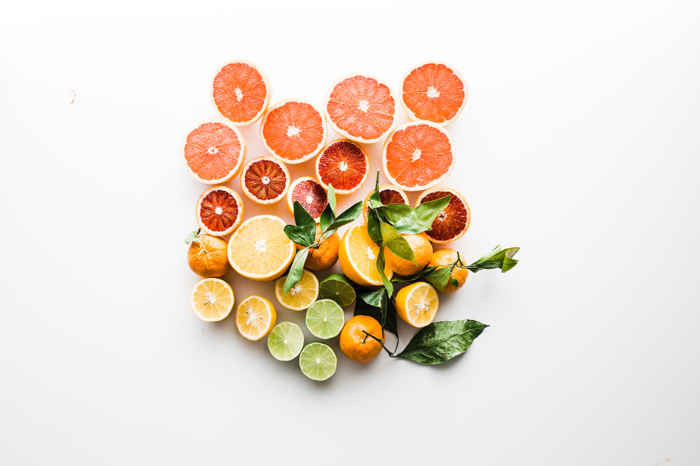

Being sedentary, with obesity, and having a bad lifestyle can lead to depression, anxiety, and/ or any kind of other mental disorder. Changing your lifestyle may help you to cure depression or improve your mental health. Let's find out what recent scientific studies say about this topic.

## Etiology of depression

Today, the etiology of depression remains unknown but is widely believed to be multifactorial, stemming from a confluence of psychological, physiological, and environmental elements. Some of the specific causes of mental disorders are trauma, neurogenesis, circadian rhythms, genetic predisposition, pharmaceuticals, gut microbes, nutrition, and/or inflammation. Also, having a chronic medical condition increases a person's risk of developing depression. [^1] [^2] [^3] [^4]

In this article, I'm going to focus on explaining the three main causes that concern me as a Nutritionist, which are gut microbes, poor nutrition, and inflammation.

### Gut Microbes

The gut-brain axis, a pathway between the gastrointestinal tract and the nervous system, is a critical component of mental health. In this pathway are tens of trillions of bacteria, viruses, and fungi that comprise the intestinal microbiota. Stress, diet, and mood can work together or independently to influence the gut microbial population, ultimately promoting microbial imbalance, and a lack of microbial diversity.[^5] Dysbiosis, which is microbial imbalance, and low diversity contribute to altered immune function, deranged appetite and metabolism, and mood changes.[^6]

Gut microbes also influence dietary choices, which, in turn, an influence which microbes survive.[^7] [^8] Adherence to a Western diet, which is high in processed foods, refined sugar, and saturated fats, promotes a misfit population of microbes that chronically activates the body's immune system.[^9] [^10] This cycle of stress, poor dietary choices, and immune responses sets the stage for self-sustaining systemic inflammation and low mood.

### Poor Nutrition

According to some research, people with depression are often deficient in several important nutrients involved in modulating inflammation, neurogenesis, and aspects of metabolism, including folate, vitamins B6 and B12, and omega-3 fatty acids.[^11] [^12] [^13]

Depressed people often follow unhealthy dietary patterns, such as poor or excessive appetite, skipping meals, "emotional eating," or preferential consumption of sweet foods.[^14] Some of these behaviors are likely due to derangements in brain function. For example, whereas depression-related loss of appetite is associated with poor interoception (the ability to perceive sensations from inside the body, including hunger) depression-related increases in appetite are associated with hyperactivity in the brain's reward circuitry.[^15]

Studies have found low serum levels of zinc in people with depression. Zinc supplementation combined with the use of a multivitamin has also been shown to reduce anger and depression compared to the use of a multivitamin alone.

#### Food with zinc

Whole bread, oatmeal, pumpkin seeds, almonds, lentils, tofu, chickpeas, walnuts.

### Inflammation

Another important cause of depression is inflammation, a critical element of the body's immune system. Inflammatory responses increase depression, anxiety, and direct our mental health.

#### What is Inflammation?

Involves immune cells, cell-signaling proteins, and pro-inflammatory factors. While acute inflammation occurs after minor injuries or infections and is characterized by local redness, swelling, or fever, chronic inflammation occurs on the cellular level in response to internal and external stressors and is often “invisible.” Chronic inflammation is instrumental in the development of many diseases, including depression. Elevated biomarkers of inflammation, which are commonly observed in people who have depression, chronically activate the body's inflammatory response system, promoting the development of depressive symptoms and inducing changes in the brain and neuroendocrine function.[^16] [^17]

Food is extremely important when talking about inflammation, it is directly linked with obesity itself and this causes a general inflammation in the body. Especially when it is about combinations of food, such as saturated fats with high refined sugars (for example a glass of milk with your cookie). This combination can cause a postprandial (after eating) inflammation response and high postprandial glucose response. Can you imagine the cellular inflammation of a person who follows a high saturated fats and refined foods diet?

## What can you do to improve your mental health?

### Dietary modification

A diet that is rich in fruits, vegetables, and healthy fats is associated with reduced depressive symptoms.[^18] [^19] [^20] Fruits and vegetables provide essential nutrients such as folate and B vitamins, most importantly, they deliver bioactive compounds such as polyphenols and others. These compounds reduce inflammation and protect cells from damage.[^21] Examining food groups in isolation showed that higher vegetable intake was related to lower depression, anxiety, and fear severity. Higher non-refined grain consumption was significantly related to lower depression and anxiety arousal severity and lower odds of having a current clinically diagnosed disorder compared to controls and these relationships persisted after adjustment for other food groups.

#### Omega-3

Omega-3 fatty acids have important anti-inflammatory, immunomodulatory, and neuroprotective properties.[^22] It promotes the production of anti-inflammatory mediators such as resolvins and protectins.[^23]. Administration of high dose supplemental omega-3 fatty acids in conjunction with antidepressant therapies offer the greatest promise in treating the symptoms of depression.

##### Food with W-3

Seaweed and algae, chia seeds, hemp seeds, flaxseeds, walnuts, edamame beans, kidney beans, soybeans

#### Probiotics

Probiotics, which can be obtained in fermented foods and dietary supplements, are live microorganisms that impart health benefits when consumed. Findings suggest that probiotic intake may help reduce negative thoughts associated with a sad mood, reduced rumination, and aggressive thoughts.[^24]

### Physical activity

Exercise, particularly endurance or high-intensity aerobic exercise, may impact kynurenine metabolism in a way that is beneficial for creating resilience against stress-induced depression. Physically active people are less likely to develop depression.

Exercise and physical activity promote a wide range of neurogenic and neuroprotective responses that mediate depressive symptoms. It increases tryptophan transport into the brain to support serotonin synthesis; prevention the formation of neurotoxins associated with depression and increases anti-inflammatory factors [^25] [^26] [^27] [^28]

## Conclusion

The combined effect of the whole diet remains important for mental health. Being sedentary, being overweight, and following a poor nutrition diet may lead to depression and anxiety or not helping to fight it while following a treatment against any mental health. Changing the way you are living can do amazing things; do exercise, meditate in God, change the way you eat and what you eat. All of these things may help you to improve your mental health.

If you have anxiety, depression, any mental health condition, or just don't "going through the best time of your life" don’t doubt in calling your doctor or looking for advice from a psychologist. Mental health disorders are like any other physical disorder and it needs to be treated by a professional. No one likes to feel sad, without energy and lack or over emotions. The best you can do for you and the people around you is looking for professional help so they can help you out from your situation.

Do you need some help with you meal plans? You can check out <a href="https://rociojalifi.com/services/nutrition/" target="_blank" rel="noopener noreferrer">my services </a> and I'll be happy to help you!

## Sources

 

[^1]: DOI: 10.1007/s11910-013-0409-5>
[^2]: Siegert, R J. Depression in multiple sclerosis: a review Journal of Neurology, Neurosurgery & Psychiatry 76, no. 4 (April 2005): 469–75. doi:10.1136/jnnp.2004.054635.
[^3]: Loh, Huai Heng, Lee Ling Lim, Anne Yee, and Huai Seng Loh. Association between subclinical hypothyroidism and depression: an updated systematic review and meta-analysis BMC Psychiatry 19, no. 1 (January 2019). doi:10.1186/s12888-018-2006-2.
[^4]: Sonino, Nicoletta, Giovanni A. Fava, Anna Rita Raffi, Marco Boscaro, and Francesco Fallo. Clinical Correlates of Major Depression in Cushing’s Disease Psychopathology 31, no. 6 (1998): 302–6. doi:10.1159/000029054.
[^5]: Rothschild, Daphna, Omer Weissbrod, Elad Barkan, Alexander Kurilshikov, Tal Korem, David Zeevi, Paul I. Costea, et al. Environment dominates over host genetics in shaping human gut microbiota Nature 555, no. 7695 (February 2018): 210–15. doi:10.1038/nature25973.
[^6]: Madison, Annelise, and Janice K Kiecolt-Glaser. Stress, depression, diet, and the gut microbiota: human bacteria interactions at the core of psychoneuroimmunology and nutrition Current Opinion in Behavioral Sciences 28 (August 2019): 105–10. doi:10.1016/j.cobeha.2019.01.011.
[^7]: Tennoune, N, P Chan, J Breton, R Legrand, Y N Chabane, K Akkermann, A Järv, et al. Bacterial ClpB heat-shock protein, an antigen-mimetic of the anorexigenic peptide -MSH, at the origin of eating disorders Translational Psychiatry 4, no. 10 (October 2014): e458–e458. doi:10.1038/tp.2014.98.
[^8]: Aarts, Esther, Thomas H. A. Ederveen, Jilly Naaijen, Marcel P. Zwiers, Jos Boekhorst, Harro M. Timmerman, Sanne P. Smeekens, et al. Gut microbiome in ADHD and its relation to neural reward anticipation PLOS ONE Edited by Kenji Hashimoto. 12, no. 9 (September 2017): e0183509. doi:10.1371/journal.pone.0183509.
[^9]: Brown, Kirsty, Daniella DeCoffe, Erin Molcan, and Deanna L. Gibson. Diet-Induced Dysbiosis of the Intestinal Microbiota and the Effects on Immunity and Disease Nutrients 4, no. 8 (August 2012): 1095–1119. doi:10.3390/nu4081095.
[^10]: Levy, Maayan, Aleksandra A. Kolodziejczyk, Christoph A. Thaiss, and Eran Elinav. Dysbiosis and the immune system Nature Reviews Immunology 17, no. 4 (March 2017): 219–32. doi:10.1038/nri.2017.7.
[^11]: DOI: 13607863.2015.1049115. Gougeon, L, H Payette, J A Morais, P Gaudreau, B Shatenstein, and K Gray-Donald. Intakes of folate, vitamin B6 and B12 and risk of depression in community-dwelling older adults: the Quebec Longitudinal Study on Nutrition and Aging European Journal of Clinical Nutrition 70, no. 3 (December 2015): 380–85. doi:10.1038/ejcn.2015.202.
[^12]: Godos, Justyna, Sabrina Castellano, Fabio Galvano, and Giuseppe Grosso. Linking Omega-3 Fatty Acids and Depression Omega Fatty Acids in Brain and Neurological Health In , 199–212. Elsevier, 2019. doi:10.1016/b978-0-12-815238-6.00013-4.
[^13]: Sánchez-Villegas, Almudena, Aurora Pérez-Cornago, Itziar Zazpe, Susana Santiago, Francisca Lahortiga, and Miguel Angel Martínez-González. Micronutrient intake adequacy and depression risk in the SUN cohort study European Journal of Nutrition 57, no. 7 (September 2017): 2409–19. doi:10.1007/s00394-017-1514-z.
[^14]: Paans, Nadine P.G., Deborah Gibson-Smith, Mariska Bot, Tatjana van Strien, Ingeborg A. Brouwer, Marjolein Visser, and Brenda W.J.H. Penninx. Depression and eating styles are independently associated with dietary intake Appetite 134 (March 2019): 103–10. doi:10.1016/j.appet.2018.12.030.
[^15]: Simmons, W. Kyle, Kaiping Burrows, Jason A. Avery, Kara L. Kerr, Jerzy Bodurka, Cary R. Savage, and Wayne C. Drevets. Depression-Related Increases and Decreases in Appetite: Dissociable Patterns of Aberrant Activity in Reward and Interoceptive Neurocircuitry American Journal of Psychiatry 173, no. 4 (April 2016): 418–28. doi:10.1176/appi.ajp.2015.15020162.
[^16]: Miller, Andrew H., and Charles L. Raison. The role of inflammation in depression: from evolutionary imperative to modern treatment target Nature Reviews Immunology 16, no. 1 (December 2015): 22–34. doi:10.1038/nri.2015.5.
[^17]: Villanueva, Rosa. Neurobiology of Major Depressive Disorder Neural Plasticity 2013 (2013): 1–7. doi:10.1155/2013/873278. DOI: 10.1186/s12916-017-0791-y>
[^18]: Ma, Jun, Lisa Goldman Rosas, Nan Lv, Lan Xiao, Mark B. Snowden, Elizabeth M. Venditti, Megan A. Lewis, Jeremy D. Goldhaber-Fiebert, and Philip W. Lavori. Effect of Integrated Behavioral Weight Loss Treatment and Problem-Solving Therapy on Body Mass Index and Depressive Symptoms Among Patients With Obesity and Depression JAMA 321, no. 9 (March 2019): 869. doi:10.1001/jama.2019.0557.
[^19]: Bot, Mariska, Ingeborg A. Brouwer, Miquel Roca, Elisabeth Kohls, Brenda W. J. H. Penninx, Ed Watkins, Gerard van Grootheest, et al. Effect of Multinutrient Supplementation and Food-Related Behavioral Activation Therapy on Prevention of Major Depressive Disorder Among Overweight or Obese Adults With Subsyndromal Depressive Symptoms JAMA 321, no. 9 (March 2019): 858. doi:10.1001/jama.2019.0556.
[^20]: Jacka, Felice N., Adrienne O’Neil, Rachelle Opie, Catherine Itsiopoulos, Sue Cotton, Mohammedreza Mohebbi, David Castle, et al. A randomised controlled trial of dietary improvement for adults with major depression (the ‘SMILES’ trial) BMC Medicine 15, no. 1 (January 2017). doi:10.1186/s12916-017-0791-y.
[^21]: Son, Tae Gen, Simonetta Camandola, and Mark P. Mattson. Hormetic Dietary Phytochemicals NeuroMolecular Medicine 10, no. 4 (June 2008): 236–46. doi:10.1007/s12017-008-8037-y.
[^22]: Simopoulos, Artemis P. Omega-3 Fatty Acids in Inflammation and Autoimmune Diseases Journal of the American College of Nutrition 21, no. 6 (December 2002): 495–505. doi:10.1080/07315724.2002.10719248.
[^23]: Calder, Philip C. Omega-3 fatty acids and inflammatory processes: from molecules to man Biochemical Society Transactions 45, no. 5 (September 2017): 1105–15. doi:10.1042/bst20160474.
[^24]: Steenbergen, Laura, Roberta Sellaro, Saskia van Hemert, Jos A. Bosch, and Lorenza S. Colzato. A randomized controlled trial to test the effect of multispecies probiotics on cognitive reactivity to sad mood Brain, Behavior, and Immunity 48 (August 2015): 258–64. doi:10.1016/j.bbi.2015.04.003.
[^25]: MELANCON, MICHEL O., DOMINIQUE LORRAIN, and ISABELLE J. DIONNE. Exercise Increases Tryptophan Availability to the Brain in Older Men Age 57 70 Years Medicine & Science in Sports & Exercise 44, no. 5 (May 2012): 881–87. doi:10.1249/mss.0b013e31823ede8e.
[^26]: Schlittler, Maja, Michel Goiny, Leandro Z. Agudelo, Tomas Venckunas, Marius Brazaitis, Albertas Skurvydas, Sigitas Kamandulis, et al. Endurance exercise increases skeletal muscle kynurenine aminotransferases and plasma kynurenic acid in humans American Journal of Physiology-Cell Physiology 310, no. 10 (May 2016): C836–C840. doi:10.1152/ajpcell.00053.2016.
[^27]: DOI: 0.1249/01.MSS.0000128186.09416.18
[^28]: Schmolesky, M. T., D. L. Webb, and R. A. Hansen. The effects of aerobic exercise intensity and duration on levels of brain-derived neurotrophic factor in healthy men J Sports Sci Med 12, no. 3 (2013): 502–11.
