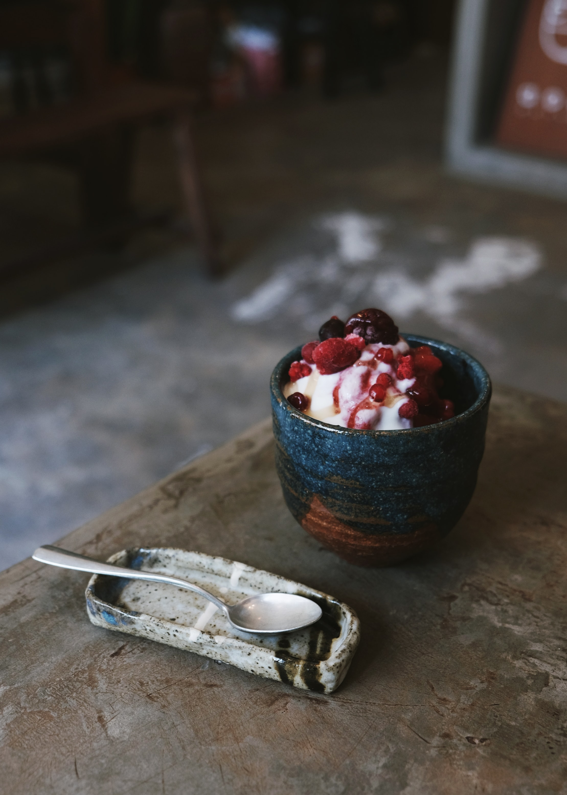

Think about all the benefits of eating whole foods, fruits, vegetables, seeds, and nuts. If you are choosing refined and processed foods, probably you don't have enough energy during the day, also it might stimulate the hunger feeling which ends up affecting your mood.

These general tips are going to help you with easy and healthy habits to implement while working from home.

##### Plan your food

When working from home it's easy to snack all the time. Avoid eating each hour. Plan your meals weekly or daily. Assess what you already have at home and plan your intake. This way you can avoid food waste, overeating, or undereating the nutrients you need for the day.

##### Be strategic about the use of ingredients

Prioritize fresh products. Use vegetables, fruits, nuts, seeds, legumes in your meals. To avoid food waste, you may consider freezing any leftovers for another meal which is also smart to save some time in the next working day. Meal prep is always a good way of being strategic with the ingredients.

##### Prepare home-cooked meals

During regular daily life, it's often to don't have the time to prepare home-cooked meals. Take advantage of the freely available online recipes, and experiment with the ingredients you can access, but remember to keep in mind the principles for healthy eating.

##### Be aware of portion sizes

It can be difficult to get portion sizes right. Being at home for extended periods, with limited activities can also lead to overeating. Seek guidance through a Nutritionist to get to know your healthy portions. Also, be mindful that young children will need smaller portions and that their nutrition it's also important.

##### Follow safe food handling practices

Only safe food is healthy food. When preparing food, it is important to follow good food hygiene practices to avoid food contamination and foodborne diseases. The key principles of good food hygiene include: keep your hands, kitchen, and utensils clean separate raw and cooked food.

##### Limit your salt intake

Prioritize foods with reduced or no added salt. You may also consider rinsing canned foods such as vegetables and beans, to remove some of the excess sodium. Be aware that pickled foods often contain high levels of sodium too. You might be consuming enough salt already, avoid adding extra salt when cooking and to your meals at the table. Experiment with fresh or dried herbs and spices for added flavor instead.

##### Limit your sugar intake

If you crave something sweet, fresh fruit should always be the priority. Frozen fruits, canned fruits in juice rather than syrup, and dried fruits with no added sugar are also good options. Limit the amount of sugar or honey added to foods and avoid sweetening your beverages.

##### Limit your fat intake

A good way of avoiding fats it by no cooking with oils, use them raw, it's also healthier for our body. Read nutrition labels to ensure that partially hydrogenated oils are not listed in the ingredients. If food labels are not available, avoid foods that commonly contain trans fats such as processed and fried foods, like biscuits, pie crusts, frozen pizzas, cookies, crackers, and kinds of margarine that include partially hydrogenated fat. Avoid the most you can processed foods and ingredients.

##### Consume enough fibre

Fibre contributes to a healthy digestive system and offers a prolonged feeling of fullness, which helps prevent overeating. To ensure an adequate fibre intake, include vegetables, fruit and wholegrain foods in all meals. I did a post talking about <a href="https://www.instagram.com/p/CFE33KJFnCg/" target="_blank" rel="noopener noreferrer">whole grains</a> that you can follow up.

##### Stay hydrated

Good hydration is crucial to be healthy. Drinking water instead of sugar-sweetened beverages is a simple way to limit your intake of sugar and excess calories. To enhance its taste, fresh or frozen fruits like berries or slices of citrus fruits may be added, as well as cucumber or herbs such as mint. Avoid drinking large amounts of strong coffee, strong tea, and especially caffeinated soft drinks and energy drinks. These may lead to dehydration and can negatively impact your sleeping patterns.

##### Avoid alcohol or at least reduce your alcohol consumption

Alcohol is not only a mind-altering and dependence-producing substance, harmful at any level consumed, but it also weakens the immune system. As a psychoactive substance, alcohol also affects your mental state and decision-making, it is also known to increase symptoms of depression, anxiety, fear, and panic – symptoms that can intensify during isolation and self-quarantine. Consuming alcohol is not a good coping mechanism, neither in the short nor long term, although you might think that it will help you deal with stress.

##### Enjoy family meals

Family meals are an important opportunity for parents to be role models for healthy eating, and for strengthening family relationships. Increased time at home during this period may also present new opportunities to involve children in cooking healthy foods, which can help them acquire important life skills that they can carry into adulthood. Letting children choose what vegetables to include in your meal may encourage them to eat them at the table. When involving children in cooking, it is important to keep meals simple and to teach children about proper food safety (including handwashing, cleaning surfaces, and avoiding consumption of certain raw ingredients).

##### Stay active!

Working from home can lead to an unplanned day. If you want to keep your self active it's good to plan it as well. It doesn't matter if it is on the morning or the evening, also doesn't matter what kind of activity. The thing is to keep your muscles active and to work in your heart condition. Take advantage of the enormous amount of videos to workout at home or in the park! Set goals and try to save at least 30 minutes for working out, your body and mind are going to be grateful.
