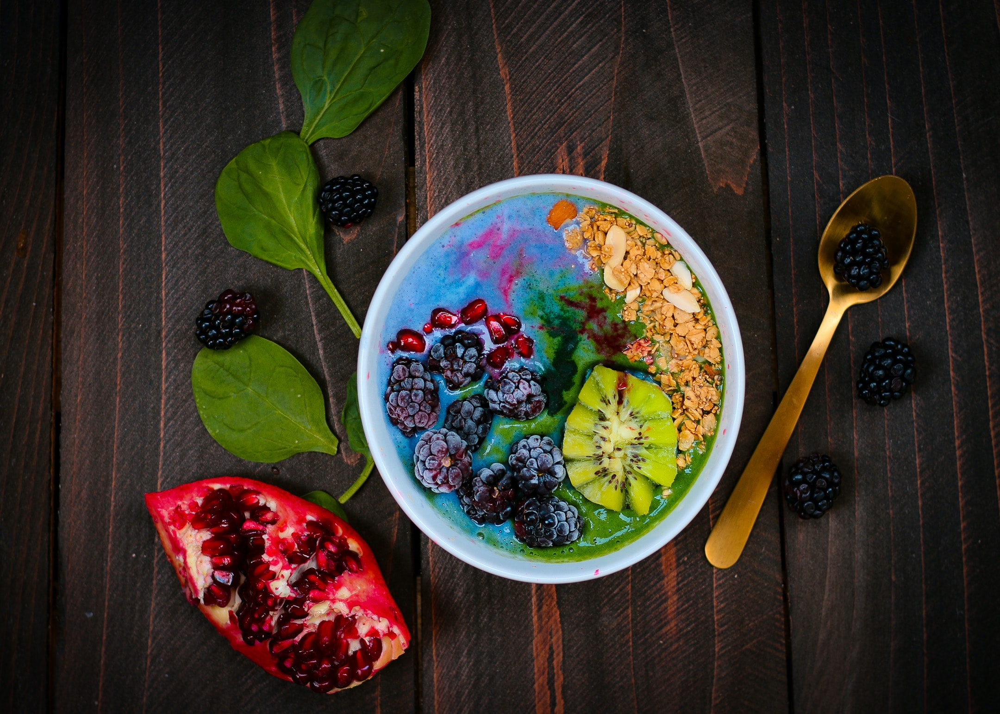

So many people have told you that you need to have a pre-workout meal or protein shake as a post-workout to full your glycogen reserve and/or build more muscle mass. I can't count how many times I advised this to my clients and I did it myself. Having different points of view, based on scientific studies, helped me out to have a more clear knowledge about this topic. Because, when is about nutrition, there are so many exceptions, and each one of them should be treated differently and the healthiest possible way. 

This article is aimed at average people who are trying to lose body fat for health reasons and trying to gain a decent amount of muscle mass. The exceptions are professional athletes, if you work out twice a day, professional bodybuilders, people that do a marathon or long-distance running, diabetics with a lot of fluctuations in blood sugar, if you are planning to do super intense exercise after a long fasting period.

## Myth #1: you need a meal before exercise 

To start with this topic I would like to talk about what is a glycogen reserve. Everyone has certain storage of sugar in the muscles, so glycogen is the storage in your muscle. It can be stored in the liver or in the muscle. 

Here is a question: Why would you want to eat something sweet before and during a workout if the goal is to burn fat? We have to burn off the sugar before we get to the fat. That's how the body works. The first half-hour we burn the sugar, after that is fat-burning. 

The other thing that most people do is to eat high concentrated protein, like whey protein. The more concentrated the protein is the more it will trigger insulin. An avocado, which has healthy fats, has much less response for insulin than a concentrated protein when powder.

### What insulin does? 

it stops the fat-burning completely. So every time you're taking whey protein or having a snack (especially when they are low in fiber), you're actually raising insulin. So why would you want to eat before doing exercise if your goal is to burn fat and increase GH (growth hormone)?

When your goal is to lose body fat or gain muscle mass, is all about calories in and calories out. You can have 1,2,3,4,5,6 meals per day with the total amount of calories you need per day to reach your goal. Just keep in mind that every time you have a meal, you activate your insulin hormones. So If you want to keep the insulin low, you need to watch out for the number of meals you have per day.

## Myth #2: you need to eat protein after your workout 

The muscle rebuild after 24 hs after you finish your exercise. If you have this idea that taking a shake after your exercise is going to build muscle, is not, it's being digested and it takes a long time for that to go into the muscles, so you don't really need protein around your workouts to build muscle mass. What indeed is going to help to build muscle is the meal that you ate yesterday, not during or immediately after your workout.

Another point to consider is, if your liver is overload with too much protein, it won't end up in your muscles. Our bodies do really good to build muscle when our liver is healthy and you don't overload it. More than 2.2 gr protein per kilo per day won't make a difference. 

Here you can check up my article about nutrients for <a href="https://rociojalifi.com/services/nutrition/" target="_blank" rel="noopener noreferrer">vegetarian athletes</a>.

**Your focus should be to avoid excess of insulin, because this one, nullifies growth hormone**

When you exercise you induce a stress event that breaks down your muscle and it burns up sugar in the muscles. Eventually, you're going to stop your exercise, and then your body is going to recover. The recovery process is where your digestion is occurring, where your body is building back up, where it's using fat. So if you eat during this process you are going to slow down the benefits of weight loss and muscle building. This doesn't mean that you won't eat anything for the whole day or evening after your physical activity. This means that you need to plan better your meals so you don't go straight away to eat/snack after exercising because this won't improve the results. You are going to have even better results if you avoid this "post-workout meal/snack" and then eat a good meal when you have to eat, especially when you aren't performing an intense physical activity.

## Key points

1. The benefits of exercise actually occur 24 to 48 hours after your exercise in a deep sleep. So part of a good strategy is getting good sleep.
1. You need to minimize the insulin while you sleep and this will have an effect on maximizing growth hormone during sleep. There should be a gap of at least 3 hours or so between your last meal and your sleep.
1. If you are not in the exceptions that I mentioned at the beginning of the article, and only interested in average health benefits, I recommend you consume healthy carbs with fiber, healthy fats, and a moderate amount of protein in breakfast.
1. Strategize intelligently your last meal of the day if you are planning to exercise before breakfast. 
1. Eat fibre! They are in vegetables, fruits, seeds, nuts, legumes, and whole grains
1. GH is trigger by exercise, sleep, and low levels of insulin. Focus on improving these to maximize your goals!

## Final thoughts

Working on your nutrition is essential to reach your goals, and is always good to contact a professional nutritionist to help you in this process. That's why I'm offering my services! You can check them up <a href="https://rociojalifi.com/services/nutrition/" target="_blank" rel="noopener noreferrer">here</a> and I'll be happy to help you!

## Sources

- [Insulin pathway: How HGH and Insulin are related and how Chromium and choline supplements can help?](https://factsonhgh.com/2015/02/27/insulin-pathway-hgh-and-insulin/)
- [Effects of growth hormone on glucose metabolism and insulin resistance in human](https://www.ncbi.nlm.nih.gov/pmc/articles/PMC5642081/)

