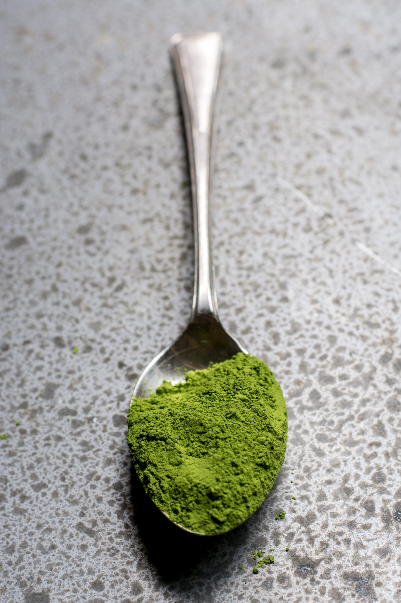

## What is Matcha Tea?

Matcha is a powdered green tea, right now famous in the world for its multiple health benefits and also because of it special taste. The diference with the rest of the teas that are presented in loose leaves, Matcha has the particularity that its leaves are ground into a very fine powder. To consume it, it is necessary to mix it with water. This makes the health benefits of matcha tea more effective than those of strand teas, since the healthy compounds that go to the cup are more concentrated.

#### Nutrients of Matcha Tea

One cup of matcha tea has the nutritional content equal to 10 cups of ordinary green tea. Also it has more antioxidants than regularly brewed green tea. You get more antioxidants out of every sip because you are consuming the entire green tea leaf. Furthermore, Matcha Tea is a good source of vitamins and minerals, such as vitamin C, zinc, magnesium, vitamin A, potassium, fiber, selenium and chromium. When Matcha Tea is made properly, it locks in the nutrients so it gets passed on to you.

#### Benefits of drinking Matcha Tea

- Energy Boom! A cup of Matcha Tea has various natural properties to boost energy and promote physical endurance. Unlike coffee, the energy boost from a cup of Matcha Tea lasts longer and does not give you a headache. As an added bonus, the presence of L-theanine in Matcha Tea provides a perfect balance to the amount of caffeine it contains. It actually prohibits the side effects of caffeine, such as nervous energy.

- It may improve brain function Thanks to L-theanine you can improving various functions related to the brain. For example, it can stimulate your inactive alpha brain waves, creating a state of calm alertness. Your alpha brain waves are responsible for your memory, imagination, visualization, learning and concentration.

- Do you want to lose weight? Adding Matcha Tea to a weight loss program can prove to be beneficial in helping you lose weight. It can stimulate your metabolism and fat oxidation. A study published by the American Journal of Clinical Nutrition discovered that EGCG in Matcha Tea has thermogenic properties.

> “It was found that consuming green tea increased thermogenesis (the body’s rate of burning calories) from 8-10% to 35-43% of daily energy expenditure.”

- Add some Clorophyll to your body! Matcha Tea’s preparation process has enriched it with elevated levels of chlorophyll. Chlorophyll has the ability to detoxify your body. When it is ingested, Chlorophyll works through your digestive system to remove toxins, heavy metals and other dangerous substances your body does not need.

- Improve your immune system The immune system is your body’s defense system. It is made up of cells, tissues and organs that work together to protect your body from bacteria, infections and fungi that causes harmful diseases. When your immune system is compromised, it makes your body susceptible to anything. Matcha Tea can strengthen your immune system due to its healthy nutrients. The antioxidants, amino acids, catechins, vitamins and minerals in the tea can help boost your immune system.

- Beautifull skin! Have you ever tried to make a Matcha mask? It's powder works just as well when applied externally. Many beauty experts have discovered the benefits of using Matcha Tea powder as a facial mask. A Matcha Tea face mask acts as a gentle detox and cleanser for your face. It can remove toxins and protect your face from free radicals and UV rays that can damage your protective skin cells.Do you have a problem with acne? Matcha Tea mask can reduce sebum production, which is responsible for acne flare-ups. To make a Matcha Tea face mask, you should start by putting a tablespoon of Matcha Tea powder into a container. Add four to five drops (enough to achieve desired consistency) of an essential oil with healing properties, such as lemongrass, lavender, jojoba, sandalwood and rose. Mix the two ingredients together and apply it to your face. You can apply this type of facial treatments once a week. The results won’t happen immediately but it is a good start toward a healthier skin.

Matcha Tea is a superfood that contains an abundance of healthful nutrients, which may improve your health or help maintain it. It is prepared and processed to ensure you that all the nutrients work together to offer you a powerfully healthful drink. If you are currently taking blood pressure pills prescribed by your doctor, you should consult him first before taking Matcha. Certain blood pressure medications may not work nicely with Matcha. Matcha tea is considered healthy and safe, but people sensitive to caffeine should be aware that both contain decent amounts of the stimulant.

Do you want to discover more superfoods? Stay tuned!
