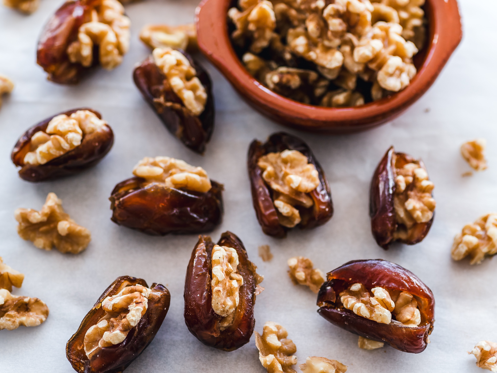

Protein, along with fats and carbohydrates, belongs to the group of macronutrients. Without these nutrients, the body can’t function properly.

> Proteins are made up of long chains of amino acids that can be broken down and reassembled in millions of different ways, to create different types of proteins and build different types of cells—each with its unique purpose. The body can produce most of these amino acids, but there is a small group called “essential” amino acids and they must be supplied by the food we eat. [1](#1)

A healthy diet needs healthy protein. With all of the things protein does to keep our bodies working, it makes sense to pack your diet with the best possible sources.

> "Fatty cuts of meat, fried or smothered cheese; processed meats filled with cancer-causing nitrites; or rich dairy products loaded with added sugars can’t deliver protein, because it activates our immune system due to the high content of components not recognized by our body, such as dead bacteria that remained from the pasteurization process." [2](#2)

These foods also tend to be high in things that place a toxic burden on the body and stoke inflammation, which contributes to heart disease and other chronic, progressive illnesses. Topping the list of villains are two ingredients often associated with protein-rich foods: sugar and fat. Meat also may contain antibiotic and steroid residues, growth hormones, and other kinds of medications that were given to an animal before slaughter.

### Why do we need Proteins?

After water, protein is the main component of cells and is essential to life. Protein is used to build and maintain these parts of our body:

- <ins>Muscles</ins>: Those responsible for movement and the muscles around our organs and our heart.
- <ins>Collagen</ins>: Provides strength and structure to tissues (e.g. cartilage in joints).
- <ins>Skin, hair, and nails</ins>: These are mainly composed of protein.
- <ins>Hemoglobin</ins>: Transports oxygen around the body.
- <ins>Hormones</ins>: Our body’s chemical messengers.
- <ins>Enzymes</ins>: Regulate the metabolism - they support important chemical reactions all over the body that allow you to digest food, generate energy to contract muscles, and regulate insulin production.
- <ins>Antibodies</ins>: Play a role in your immunity.

After the age of 50, unless we act to prevent it, we may lose 1% of muscle mass each year and with it, muscle strength. It’s important to maintain muscle mass because it’s what helps keep us strong and keep us moving – and that’s what helps contribute to living a full and active life. Combining adequate dietary protein spread over the day with resistance exercise training using all the major muscle groups helps maintain muscle mass.

### How much Protein should I eat?

There are a lot of online calculators that claim they can help you find the right amount of protein for your weight and age, but I wouldn’t recommend them. Instead, I prefer to calculate the amount of protein in your diet as a percentage of your overall food intake or depending on the kind of exercise you do. Next, make sure you choose organic products to avoid toxins and GMO (genetically modified) foods.

### How do I get Protein?

Be sure to prioritize foods such as tofu (made from soybeans), tempeh (made from fermented soybeans), and seitan (from wheat gluten, if you’re not sensitive), along with grains like quinoa and buckwheat. They have the full complement of essential amino acids. I recommend you to each day include a big portion of greens, you can also drink organic chlorophyll and spirulina to get more pure protein.

It’s also possible to get all of the essential amino acids by combining other protein sources, such as beans and rice, or any kind of legume and cereal. You don’t necessarily have to get a complete set of amino acids at every meal, or in every food. Just make sure you meet the cumulative total for the day.

You can even get your protein in healthy snacks like a handful of nuts, a green smoothie, or any other snack free of additives, GMO ingredients, and artificial colors and flavoring.

Proteins are one of the most fundamental and vital nutrients we need for health. Make sure you fuel your body with the best sources to keep it running! 💪

---

I you are looking to include proteins in your diet in a healthy and balanced way check out my [instagram](https://bit.ly/senoritanutrition)!

Footnotes

- 1: [Nutricion Vitalizante by Nestor Palmeti](https://nestorpalmetti.com/libros/libro-nutricion-vitalizante/). Original in Spanish, translated by me.
- 2: [Nutricion Vitalizante by Nestor Palmeti](https://nestorpalmetti.com/libros/libro-nutricion-vitalizante/). Original in Spanish, translated by me.
