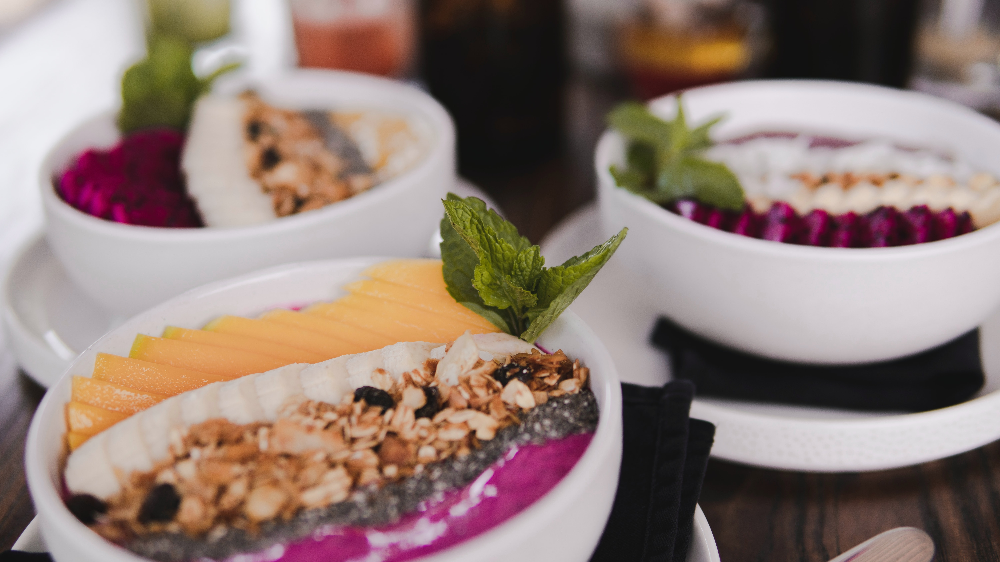

## Is a plant-based diet healthy?

One common concern is whether a vegan diet provides enough Vitamin B12, Iron, or Protein. That is why I want to share with you what science says about it.

#### Lack of B12

B12 helps prevent nerve damage, and is found in meat, fish, eggs, and dairy, but not in all the fruits or vegetables. It's recommended that adults consume 1.5 micrograms of the vitamin per day.

> A B12 deficiency can lead to neurological symptoms such as numbness, and it’s irreversible if the deficiency is present for too long.

Says Janet Cade, of the Nutritional Epidemiology Group, School of Food Science and Nutrition.

> It’s easy to get the “minuscule” amount of B12 we need from nutritional yeast or fortified food, such as plant-based milk.

Says Marco Springmann, senior researcher of environmental sustainability and public health at the University of Oxford.

##### B12 sources

Tempeh, seaweed, mushrooms, fortified kinds of milk, fortified and cereals.

#### Lack of Iron:

> It’s unlikely a vegan diet will cause an iron deficiency, as long as your diet includes fruit and vegetables of every color.

> Over time, the body can adapt to how much iron there is in our diet, and if you have a lower iron intake it can make more efficient use of that iron.

Says Springman.

##### Sources of Iron

Oatmeal, raisins, lentils, chickpeas, beans, tofu, cashew nuts, chia seeds, linseed and hemp seeds, kale, figs, apricots and quinoa.

#### Lack of protein

> We’ve never seen issues with protein deficiencies, only in people who don’t eat enough calories. Protein is in everything. For those who are concerned, soy milk has roughly the same amount of protein as cow’s milk.

Says Springman.

##### Protein sources

Tempeh, tofu, seitan, lentils, chickpeas and any kind of beans, nutritional yeast, spelt and teff, oatmeal, hempseed, green beans, spirulina, amaranth, quinoa, wild rice, chia seeds, nuts, and nuts butter, and other seeds, any kind of green vegetables.

Springman advises eating plenty of fruit and vegetables with a variety of colors, nuts, whole grains and beans, and lentils, as well as chia, hemp, and flax seeds, which contain omega 3. And That a balanced vegan diet is one of the healthiest diets.

> "We’ve found that the vegan diet could be one of the healthiest diets, outperforming pescatarian and vegetarian, because the vegan diet is higher in fruit, vegetables, and legumes and the health benefits from this compensate anything else,”

### Conclusion

A plant-based diet is much like any other. It can help to lower your risk of disease or increase it – depending on the foods you eat. The best plant-based diet is one that includes lots of fruit and vegetables, and B12 supplements, and less vegan junk food.

###### Source

<a href="https://www.bbc.com/news/science_and_environment" target="_blank" rel="noopener noreferrer">BBC</a> web-site. From the date: 23/01/2020
