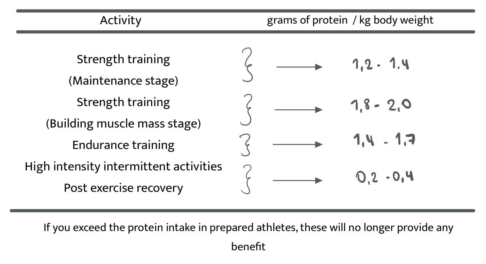

These days more and more athletes are becoming aware of the environment and decide to change their diet and lifestyle. Let see what scientific papers say about the benefits of a vegetarian or vegan diet.

### Benefits of a vegetarian diet for athlets

According to the American Dietetic Association and the Academy of Nutrition and Dietetics, it has been shown that the vegetarian diet has increased the improvement of people's health, providing benefits in preventing diseases (Torres et al., 2017)

A vegetarian diet is of great benefit at any stage of life, as well as in athletes. Currently having a <a href="https://rociojalifi.com/blog/science-plant-based/" target="_blank" rel="noopener noreferrer">vegetarian diet</a> causes positive effects on human health, helping to reduce or prevent any type of diseases, such as diabetes, obesity, cardiovascular disease, or any type of cancer. (Gomez, S; Pino, P; Borges, C; Teixeira, C; Santos, A & Graca, 2015)

The Vegetarian Society of the United Kingdom defines a vegetarian as one who lives on a diet based on legumes, grains, nuts, fruits and vegetables with or without implementing dairy products and eggs, but without consuming any type of meat.

An athlete who applies the vegetarian regimen to his life can influence sports performance, both positively and negatively if his diet is not well formulated (B & Julieta, 2013).

Vegetarianism will have an impact due to the higher consumption of macronutrients such as carbohydrates and proteins, as well as micronutrients, iron, zinc, calcium, polyunsaturated fatty acids (Omega 3), vitamin B12, creatine, and antioxidants are considered (Ares, 2018).

#### Athlete’s proteins consumption

During sports training, these nutrients provide energy that varies between 5 and 10%. If you exceed the protein intake in prepared athletes, these would no longer provide any benefit (Olivos et al., 2012).

##### Protein functions

- Structural (collagen, myosin, actin)
- Biochemicals (enzymes)
- Transport (hemoglobin)

Here you can find some <a href="https://rociojalifi.com/blog/science-plant-based/" target="_blank" rel="noopener noreferrer">plant-based</a> protein sources

If you want to read more about <a href="https://rociojalifi.com/blog/proteins/" target="_blank" rel="noopener noreferrer">Proteins functions</a> check out my article.

#### Athlete's carbohydrates consumption

Carbohydrates are the main source in the vegetarian diet of an athlete, for the energy it provides to the human body. Carbohydrates provide the energy the body needs to perform muscle contraction during activity or exercise (Olivos et al., 2012).

Carbohydrates provide in greater amounts through legumes, grains, nuts, seeds (B & Julieta, 2013).

##### Functions of Carbohydrates

- They maintain the level of glycogen
- They prevent hypoglycemia
- They help improve physical performance

By eating plant foods that do not suffer alteration in their composition, it gives us a healthy life, nutritionally surpassing meat, eggs, and dairy (Bradley et al., 2013).

If you want to read more about <a href="https://rociojalifi.com/blog/carbohydrates/" target="_blank" rel="noopener noreferrer">Carbohydrates functions</a> check out my article.

### Final thoughts

When it comes to the vegetarian sports population, the diet requires careful adjustment in order to cover all needs and not lead to any deficit. There are key points to which special attention must be paid in this type of diet. Energy intake is generally lower in the vegetarian population compared to omnivorous diets. However, proper diet planning will meet these demands[^2].

As for dietary protein, it is less bioavailable and some foods are limited in certain amino acids. However, good use of food and a suitable combination of them will be able to cover the needs[^3].

The consumption of omega 3 fatty acids in the vegetarian population is compromised. Its conversion in the body, beneficial effects, as well as its supplementation and dosage, require more research, both in the omnivorous and vegetarian population[^4].

Creatine supplementation in vegetarians / vegans, given their low levels of muscle creatine, has shown greater efficacy in filling these deposits and improving performance compared to the omnivorous population[^5].

**It cannot be concluded that sports performance is affected by following vegetarian / vegan diets, or that they lead to some nutritional deficit in the sports population when this type of diet is properly planned and organized by a professional[^6].**

When analyzing the influence on the health of vegetarian / vegan diets, it cannot be concluded that they are bad for health. Furthermore, a vegetarian / vegan diet, properly planned and controlled by a professional, is nutritionally adequate and healthy for all types of the population at any stage of life[^1].

### Sources

- Ares, G. C. (2018). Nutrición Deportiva y Nutrición Clínica Dieta vegetariana : influencia en el rendimiento deportivo. Trabajo Final de Nutrición Deportiva., 13. B, V. L., & Julieta, L. (2013).
- Evaluación del efecto de la alimentación vegetariana en el rendimiento deportivo. Revista Del Hospital Italiano de Buenos Aires, Perón 4190, CABA, 14(2), 109–114.
- Bradley, S; Graham, D; Mowris, L; Bauer, B; Lucke, J; Ruscigno, M; Wes, M. (2013). Organic Athlete. Guía de Nutrición.
- Ares, G. C. (2018). Nutrición Deportiva y Nutrición Clínica Dieta vegetariana : influencia en el rendimiento deportivo. Trabajo Final de Nutrición Deportiva., 13. B, V. L., & Julieta, L. (2013).
- Evaluación del efecto de la alimentación vegetariana en el rendimiento deportivo. Revista Del Hospital Italiano de Buenos Aires, Perón 4190, CABA, 14(2), 109–114.
- Bradley, S; Graham, D; Mowris, L; Bauer, B; Lucke, J; Ruscigno, M; Wes, M. (2013). Organic Athlete. Guía de Nutrición. Retrieved fro m http://weekly.cnbnews.com/news/article.html?no=124000
- Olivos, Cristina; Cuevas, Ada; Álvarez, Veronica; Jorquera, C. (2012). Nutrición para el Rendimiento y la Competición. Revista. Media. Clinica Las Condes. Centro de Alto Rendimiento (C.A.R.)., 23(3), 253–261.

 

[^2]: Loucks AB. Energy balance and body composition in sports and exercise. J Sports Sci. 2004;22(1) :1-14
[^3]: Barr SI, Rideout CA. Nutritional Considerations for Vegetarian Atlethes. 2004;20:696-703
[^4]: Welch AA, Shakya-Shrestha S, Lentjes MA, Wareham NJ, Khaw KT. Dietary intake and status of fish-eating and non-fish-eating meat-eaters, vegetarians, and vegans and the product-precursor ration [corrected] of a-linolenic acid to long-chain n-3 polyunsatured fatty acids: results from the EPIC-Norfolk cohort. Am J Clin Nutr. 2010;92(5):1040-51
[^5]: Kreider RB, Kalman DS, Antonio J, Ziegenfuss T, Wildman R, Collins R, et al. International Society of Sport Nutrition position stand. Safety and efficacy of creatine supplementation in exercise, sport and medicine. J Int Soc Sports Nutr. 2017;14:18
[^6]: Pawlak R, Parrott SJ, Raj S, Cullum-Dugan D, Lucus D. How prevalent is vitamin B(12) deficiency among vegetarians?. Nutr Rev. 2013; 71(2):110-7
[^1]: Melina V, Craig W, Levin S. Position of the Academy of Nutrition and Dietetics Association: vegetarian diets. J Am Diet Assoc. 2016;116(12):1970-80
