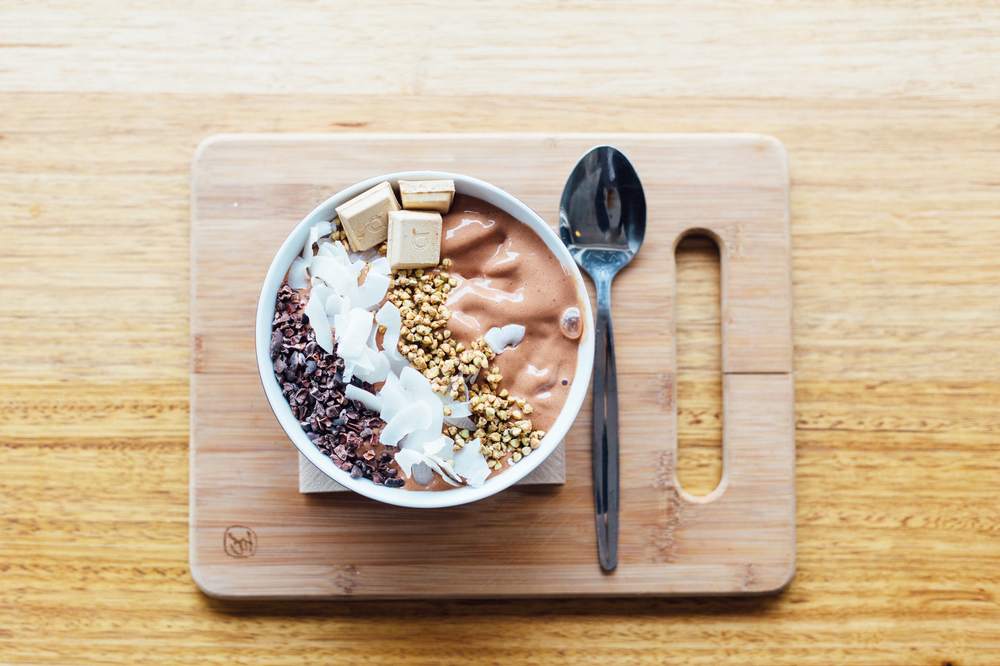

## Introduction 

Regarding nutritional needs, a differentiation must be made between the general population and the sports population. 
The guidelines and recommendations for the general population may differ for the sports population and vice versa. The practice of physical exercise, whatever it is, supposes different nutritional needs from those who don't do any type of activity.

This is even more noticeable in high-performance or elite athletes, where eating patterns and paying more detailed attention to certain factors will make the difference between victory or defeat.

**In athletes (as in the general population), individualization should be the main pillar around which the rest of the strategies have to be established.**

## Keys to design the proper meal plan

- Maintain an adequate and healthy diet and hydration.
- Guarantee an optimal energy intake according to the sports discipline and objective sports.
- Adapt the intake of the different macro and micronutrients at each moment of the season.
- Use proper "timing" of macro and micronutrients about sessions of training.
- Assess whether or not the use of supplementation is necessary.

**These basic points will be common in all types of athletes (omnivores or vegetarians).**

If you want to read more about vegetarian food patterns and sport you can read my previous <a href="https://rociojalifi.com/blog/science-vegatarian-sports-part-1/" target="_blank" rel="noopener noreferrer">blogpost</a>

## Micronutrients to consider

### Iron 

> Essential macromineral knew and investigated for its nutritional deficiency (Andreu Ivorra, 2016. In the performance of an athlete, iron is a nutrient of great importance, because in the blood (hemoglobin), is the component that carries oxygen to the muscles (myoglobin) (Burke, Louise; Cox, 2010).

- Heme iron: Present in plant-based foods.
- Non-heme iron: Present in plant-based foods and eggs.
- Foods with ferric content: Plant-based foods do not have heme iron, it is not fully absorbed by the body, but its absorption increases in the presence of vitamin C (Canada, 2005).

An athlete's vegetarian diet should be rich in iron content such as spinach, broccoli, lentils, soy, asparagus, and sesame and pumpkin seeds. The daily intake of iron is 32 mg/day in women, and 14 mg/day in men. (B & Julieta, 2013).

### Zinc

> Micromineral found in large quantities in the body. There is no clinical evidence of zinc deficiency in vegetarians (Gomez et al., 2015). However, according to (B & Julieta, 2013), if zinc levels are lower than recommended, this could cause a decrease in cardiorespiratory function, muscle strength, and endurance.

#### Foods with Zinc content

Whole grains, dried fruits, seeds, beans are rich in zinc, but contain a large number of phytates. To obtain a reduction in this, soak the grains and legumes, this increase their bioavailability (B & Julieta, 2013).

For athletes who maintain a vegetarian diet, it is difficult to concentrate this micromineral in plasma, due to the constant exercise that leads to urinary loss. Therefore, the daily intake of zinc is 12 mg/day in women and 16.5 mg/day in men. (B & Julieta, 2013).
 
### Calcium

> It is a mineral of great importance. It keeps teeth and bones in good condition. Calcium is found in various fortified and plant-based foods (Andreu Ivorra, 2016).

#### Foods with Calcium content

Kale, Chinese chard, Chinese broccoli, turnip greens provide calcium in high bioavailability, fortified soy drink, fruit juice, almonds, figs, and all foods derived from soy are an additional source of calcium ( Canada, 2005).

### Vitamin B12

> It is important for the synthesis of DNA and the maintenance of neurons. Bacteria, fungi, and microorganisms are synthesized by vitamin B12 (Gomez et al., 2015).

#### Foods with B12 content

The foods that are a source of this vitamin come from animal origin. However they can be found in fortified foods such as nutritional yeast, algae, spirulina, and soy drink.

The consumption of vitamin B12 is deficient in vegetarian diets. Therefore, the vegetarian population must use supplements to reach the recommended doses of vitamin B12, in vegetarians 3.09 μg / day, in women and men 2.4 μg / day.
 
### Antioxidants

> In the sports field, the constant exercise of a high-performance athlete can cause oxidative stress in the tissues, thus causing muscle pain and also affecting their recovery, for this  reason, it is recommended that the intake of antioxidants in athletes is increased (B & Julieta, 2013).

#### Foods with antioxidant content

Vegetarian diets provide a greater amount of antioxidants such as vitamin C, vitamin E, and beta carotenes. Daily intake for athletes is 100 - 1,000 mg/day (B & Julieta, 2013).

### Creatine

> It is known to be a nitrogen compound that is located in muscle tissue, The synthesis in the body of the person is 1 g / day, but it is required mostly in 2 g / day in athletes (Olivos et al., 2012).

Currently, its supplementation helps to improve the performance of a high-intensity athlete, as well as gaining muscle mass (B & Julieta, 2013).

### Omega 3

> They are polyunsaturated fatty acids. It's contribution to the diet is necessary. These fatty acids have anti-inflammatory, antiarrhythmic, antithrombotic, and antiproliferative (Ares, 2018).

To help the performance of vegetarian athletes, the consumption of omega 3 should be increased and the consumption of omega 6 reduced (Ares, 2018).

#### Foods with Omega 3 Content

Vegetarian athletes should eat foods such as seeds, chia seeds, flax seeds, hemp seeds, and walnuts. The recommended daily intake of Omega 3 in children and adults is 0.6 - 1.2 mg/day (Ares, 2018).

## Conclusion

A growing body of scientific evidence indicates that wholesome vegetarian diets offer distinct advantages compared to diets containing meat and other foods of animal origin.
The benefits arise from lower intakes of saturated fat, cholesterol, and animal protein as well as higher intakes of complex carbohydrates, dietary fiber, magnesium, folic acid, vitamin C and E, carotenoids, and other phytochemicals.

In the past, vegetarian diets have been described as being deficient in several nutrients including protein, iron, zinc, calcium, vitamin B12, and A, n-3 fatty acids, and iodine. Numerous studies have demonstrated that the observed deficiencies are usually due to poor meal planning. Well-balanced vegetarian diets are appropriate for all stages of the life cycle, including children, adolescents, pregnant and lactating women, the elderly, and competitive athletes. In most cases, vegetarian diets are beneficial in the prevention and treatment of certain diseases, such as cardiovascular disease, hypertension, diabetes, cancer, osteoporosis, renal disease, and dementia, as well as diverticular disease, gallstones, and rheumatoid arthritis. 

Professional nutritionists must educate individuals who take the option of starting any type of vegetarian diet and help them to implement it properly, to cover all the macro and micronutrients required according to their age and metabolic status, to promote normal growth and development.

Do you need help with your eating patterns? You can check out <a href="https://rociojalifi.com/services/nutrition/" target="_blank" rel="noopener noreferrer">my services </a> and I'll be happy to help you! 

### Sources

- Ares, G. C. (2018). Nutrición Deportiva y Nutrición Clínica Dieta vegetariana : influencia en el rendimiento deportivo. Trabajo Final de Nutrición Deportiva., 13. B, V. L., & Julieta, L. (2013).
- Evaluación del efecto de la alimentación vegetariana en el rendimiento deportivo. Revista Del Hospital Italiano de Buenos Aires, Perón 4190, CABA, 14(2), 109–114.
- Bradley, S; Graham, D; Mowris, L; Bauer, B; Lucke, J; Ruscigno, M; Wes, M. (2013). Organic Athlete. Guía de Nutrición.
- Ares, G. C. (2018). Nutrición Deportiva y Nutrición Clínica Dieta vegetariana : influencia en el rendimiento deportivo. Trabajo Final de Nutrición Deportiva., 13. B, V. L., & Julieta, L. (2013).
- Evaluación del efecto de la alimentación vegetariana en el rendimiento deportivo. Revista Del Hospital Italiano de Buenos Aires, Perón 4190, CABA, 14(2), 109–114.
- Bradley, S; Graham, D; Mowris, L; Bauer, B; Lucke, J; Ruscigno, M; Wes, M. (2013). Organic Athlete. Guía de Nutrición. Retrieved fro m http://weekly.cnbnews.com/news/article.html?no=124000
- Olivos, Cristina; Cuevas, Ada; Álvarez, Veronica; Jorquera, C. (2012). Nutrición para el Rendimiento y la Competición. Revista. Media. Clinica Las Condes. Centro de Alto Rendimiento (C.A.R.)., 23(3), 253–261.
- https://www.semanticscholar.org/paper/Vegetarian-diets%3A-what-are-the-advantages-Leitzmann/7b7b78d744f8fd625341bf2d07699c2473a4a22f

