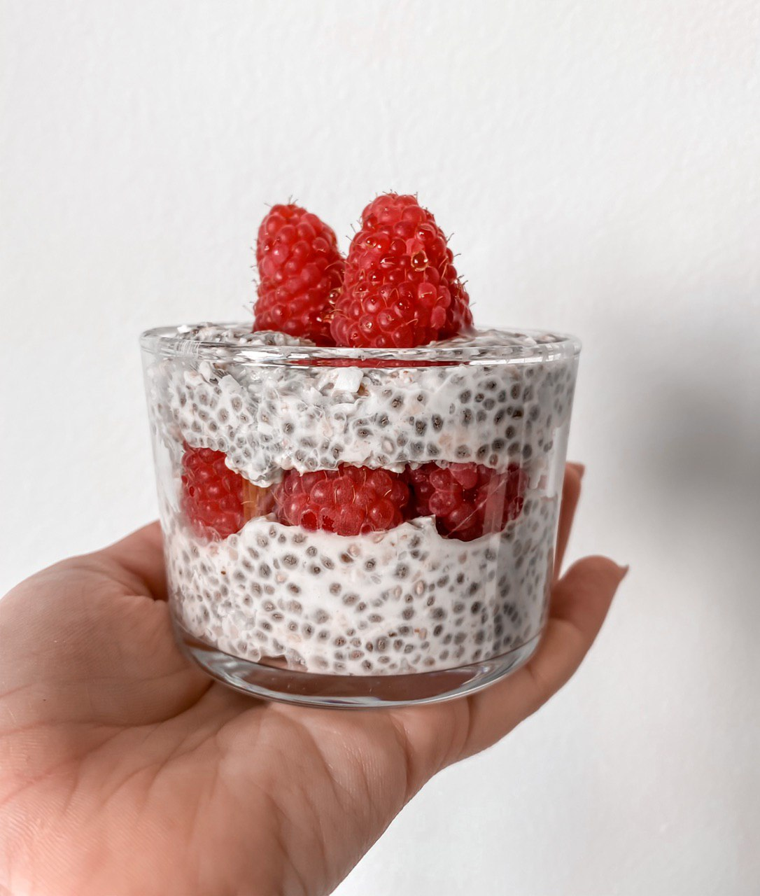

I find this topic very interesting since I see more people turning their attention into seeds. That's why I want to share with you some captivating things about them.

#### What are they?

Wikipedia defines seeds as ...

> an embryonic plant enclosed in a protective outer covering. The formation of the seed is part of the process of reproduction in seed plants ... [1](#1)

Seeds metaphorically are like eggs. They Have a cover, which protects the embryo from starting the germination process. And also they have nutrients inside, which feed the embryo during the germination process.

#### Why eat seeds?

Did you know that seeds are one of the most nutritious foods on the planet? Despite their tiny size, seeds should be considered a superfood because of the number of nutrients they contain. I definitely think seeds are undervalued. When I was doing my Nutrition studies at University, we talked a lot about grains, vegetables, fruits and nuts, but little about seeds. Usually, we, as nutritionists, recommend them because they have healthy fatty acids, but they are also full of zinc, calcium, magnesium, fiber, and proteins!

#### What's the best way we can eat them?

Here is the thing, our gut isn’t 100% ready to decompose seeds. Do you remember I mentioned seeds having a cortex to protect them? Turns out the cortex effectively does its job preventing our stomach and intestines from decomposing them 100% and as a result, we won't absorb their nutrients fully. That's why is smart to expose them to a process where we can soften that cortex and absorb the maximum of their nutrients. We have 3 different ways of doing this:

- _You can heat them up:_ put the seeds on a pan and warm them up a little, be careful to not burn them! In this process, you get the oils out from the seed, that's why through the heat adds flavor. But the heat also burn some the nutrients. I recommend you to eat them at the moment you finish this process. Otherwise, the oil will get rusty when exposed to the oxygen in the air and lose even more nutrients.

- _You can break them:_ either with a food processor or any kitchen utensil you can break the seeds. After this process, you should eat them immediately, otherwise, the result is going to be the same as with the heating process.

- _Soak the seeds overnight:_ You can soak them with water or any vegetable drink like almod milk. The next day you can always add some sweetener, fruits, or yogurt. With this process, you’ll soften the seed cortex, which helps our body to absorb the nutrients 100%. This way its the one I recommend most! You still eating the seeds on their raw state, it's super easy, takes almost no time and you have plenty of recipes to follow up.

#### Benefits

Seeds contain all the starting materials necessary to develop into complex plants. Because of this, they are extremely nutritious.

###### Omega 3

Flax, chia and hemp seeds come up top for omega-3 – an essential fat that is excellent for heart and brain functions, often lacking in most diets. Hemp seed also contain omega-6.

###### Protein and essential amino acids

Quinoa, amaranth, chia and hemp seeds offer complete proteins, meaning that the contain all 9 essential amino acids required for optimal health. Using a balance of different seeds in your diet will also ensure a great supply of protein.

###### Nutrient dense

Eating a variety of different seeds, over the course of your week, will ensure that your body receives a healthy dose of phosphorus, magnesium, selenium, manganese, zinc, iron, copper, B vitamins, vitamin K and antioxidant rich vitamin E (and more).

###### Source of fiber

Like most plant based foods, seeds are naturally full of fibre. Fibre is good for controlling the levesl of sugar in the blood, helping to slow the breakdown of carbohydrates, and lowering the absorption of sugar. Fibers are also great for promoting healthy bowel movement, heart health, and weight-loss management.

###### Lower cholesterol and blood pressure

Seeds possess important cholesterol-fighting fibres known as [lignans](https://en.wikipedia.org/wiki/Lignan). In particular flax, chia and sesame seeds contain exceptionally beneficial levels – more than most other foods. Flax, is one of the highest rated antioxidants amongst plant foods, coming up top for [polyphenols](https://en.wikipedia.org/wiki/Polyphenol), which are superstars in the antioxidant world.

### Including more seeds in your daily culinary choices

I have found clever ways to include seeds in my daily culinary choices. I often start the day with a chia bowl, that includes chia seeds (duh!), and sesame or flax seeds. I might enjoy a sprouted-seed pâté to give more give more flavor to the luch main dish. My salad typically contains a sprinkle quinoa seeds (raw or roasted) with some veggie burger and ,of course, vegetables.

---

I have a lot of recipes to share with you! Check out on my [instagram](https://bit.ly/senoritanutrition) to see them!

Footnotes

- 1: [Wikipedia: Seed](https://en.wikipedia.org/wiki/Seed)
