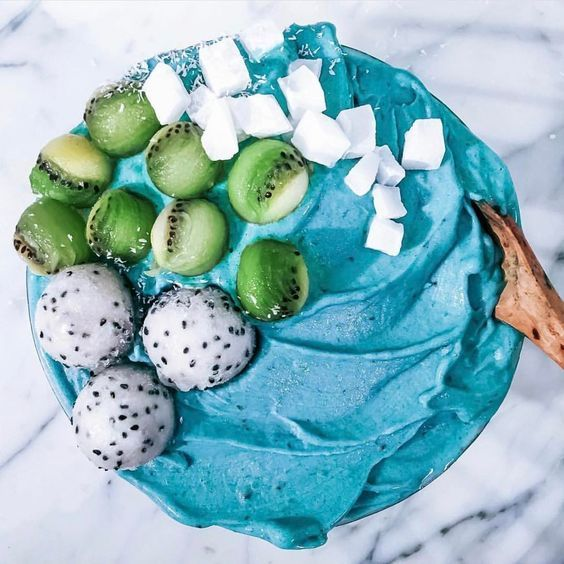
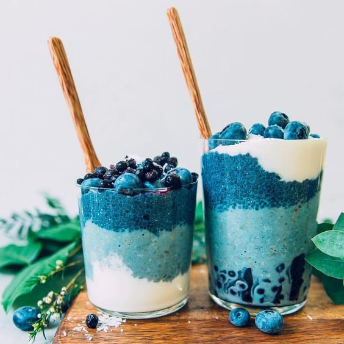

## What is Spirulina?

Spirulina is a blue-green alga that became famous after it was successfully used by NASA as a dietary supplement for astronauts on space missions. It has the ability to modulate immune functions and exhibits anti-inflammatory properties by inhibiting the release of histamine. 

Multiple studies investigating the efficacy and the potential clinical applications of Spirulina in treating several diseases have been performed and a few randomized controlled trials and systematic reviews suggest that this alga may improve several symptoms and may even have anticancer, antiviral, and antiallergic effects.

This alga has been used as a source of protein and vitamin supplement in humans without any significant side-effects. Apart from the high (up to 70%) content of protein, it also contains vitamins, especially B12 and provitamin A (β-carotenes), and minerals, especially iron. Spirulina lacks cellulose cell walls and therefore it can be easily digested.

## Benefits of consuming Spirulina

### Spirulina and chronic fatigue 

Spirulina has been promoted as “the food of the future" that contributes to high energy levels.
Spirulina increases healthy lactobacillus in the intestine, enabling the production of Vitamin B6 that also helps in energy release.

## Allergy and rhinitis

In a recent double-blind, placebo-controlled study from Turkey evaluating the effectiveness and tolerability of Spirulina for treating patients with allergic rhinitis, Spirulina consumption significantly improved the symptoms compared with placebo, including nasal discharge, sneezing, nasal congestion, and itching.

Deficiency of nutrients is responsible for changes in immunity, which manifests as changes in the production of antibody response. The above studies suggest that Spirulina may modulate the immune system by its role in covering nutritional deficiencies.

## Antiviral properties

The advantage of using herbs and algal products with proven antiviral properties in fighting certain viruses is that they can be used—through immunomodulation—even when the infection is established.

## Lows cholesterol

A more recent study administered Spirulina supplements in ischemic heart disease patients and found a significant reduction in blood cholesterol, triglycerides and LDL cholesterol and an increase in HDL cholesterol.
Mani et al.[^1] in a clinical study found a significant reduction in LDL : HDL ratio in 15 diabetic patients who were given Spirulina.

## May have anti-cancer properties

Some evidence suggests that spirulina has anti-cancer properties. Research in animals indicates that it can reduce cancer occurrence and tumor size.
Spirulina’s effects on oral cancer — or cancer of the mouth — have been particularly well studied.
Among those who took 1 gram of spirulina per day for one year, 45% saw their lesions disappear — compared to only 7% in the control group. 

## Plant source of protein

Spirulina contains a whopping 70% complete protein - unlike many plants it actually contains all essential amino acids (that your body cannot produce and needs to obtain from food). Spirulina also has a higher Protein Efficiency Ratio (PER) – its protein is 4x more absorbable than protein that comes from beef.

## Chemical composition

- **Protein:** 8 essential amino acids but not a lot of methionine. 70 gr of proteins for 100 gr of dry spirulina.
- **Carbohydrates**: 18 gr for 100 gr of dry spirulina.
- **Vitamins**: E B (B1, B2, B3, B12) and K
    - **Vitamin B1 (thiamine):** 11% of the RDA
    - **Vitamin B2 (riboflavin):** 15% of the RDA
    - **Vitamin B3 (niacin):** 4% of the RDA
- **Minerals** iron, calcium, and magnesium. Oligo-elements: selenium, zinc, iodic,and Borum.
    - **Copper:** 21% of the RDA
    - **Iron:** 11% of the RDA
- **Essential fatty acid** 6gr of lipids for 100 gr of dry spirulina.
- **Enzymes** among which superoxide dismutase (SOD) : an important enzyme against free radicals and stress oxidant.
- **Pigments** such as C–phycocyanin (blue pigment), beta-carotene (orange pigment) with antioxidant propriety and chlorophyll.

## Easy recipes with Spirulina

### Spirulina water

- 500 ml sparkling water
- 1 fresh lemon in slices
- 6 drops pure stevia (or 1 teaspoon organic rice malt syrup)
- 1-2 teaspoons of spirulina

### Smoothie bowl

- 1-2 cups unsweetened full fat coconut milk (depending on how thick you want it to be)
- 1 cup frozen organic mixed berries
- Stevia to taste
- 1/2 banana
- 2 teaspoons spirulina
- 1/2 handful spinach or kale
- Blend everything and add fresh fruits and nuts on the top to dacorate it!

 

Working on your nutrition is essential to reach your goals, and is always good to contact a professional nutritionist to help you in this process. That's why I'm offering my services. You can check them up <a href="https://rociojalifi.com/services/nutrition/" target="_blank" rel="noopener noreferrer">here</a> and I'll be happy to help you!

## Sources

- [Spirulina and clinical practice: Evidence-Based Humans Applications](https://www.ncbi.nlm.nih.gov/pmc/articles/PMC3136577/)

 

[^1]: Mani UV, Desai S, Iyer U. Studies on the long-term effect of Spirulina supplementation on serum lipid profile and glycated proteins in NIDDM patients. Journal of Nutraceuticals, Functional and Medical Foods. 2000;2(3):25–32.

