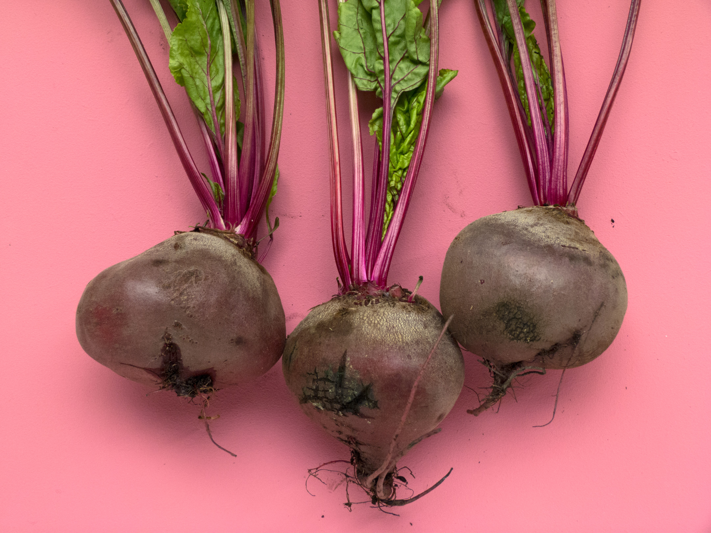
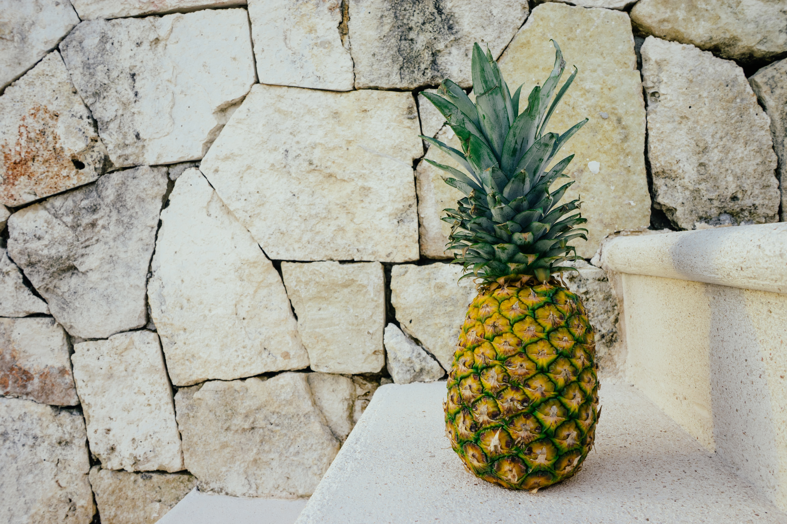

## What to do for a heavy period? 

This is an estrogen dominance situation. If you are taking birth control pills or some type of estrogen, or you want to find some alternative because you are contributing too much estrogen to your body you may want to do some changes to avoid a heavy period situation.

### Foods to avoid
- **Avoid dairy:** dairy may definitely increase your estrogen levels
- **Avoid red meat:** Meat is high in prostaglandins and should be avoided during menstruation. high levels of prostaglandins may cause cramps.
- Avoid foods that you don’t tolerate well and alcohol.
- **Avoid coffee:** It can cause water retention, bloating, and diarrhoea
- **Avoid sugar!** This can make your mood worse. If you tend to feel moody, depressed, or anxious during your period, watching your sugar intake can help regulate your mood.

### Foods to consume 

- **Cruciferous vegetables:** these are anti-estrogen. Especially the bad type of estrogen that creates negative effects. Consuming either concentrated cruciferous products or cruciferous vegetables themselves can help to balance out the estrogen. It can create a huge benefit on your menstrual cycle. 

- **Increase the amount of water:** Staying hydrated can reduce your chances of getting dehydration headaches, and also stops water retention and bloating.

- **Fruits:** They help with your sugar cravings. You can eat them in smoothies, fruit salads, or with yogurt.

- **Green vegetables:** Leafy green vegetables such as kale and spinach can boost your iron levels. Spinach is also rich in magnesium. You can eat them fresh in salads, or you can add them, to your fruit smoothies.

- **Ginger:** it is anti-inflammatory. Ginger effectively reduces nausea and vomiting symptoms and the best of all is that it is cheap! You can add it to your fresh juices. I assure you that it can make veegtable juices taste much better.

- **Turmeric:** it is an anti-inflammatory spice. I like to eat ir with tofu or drink it with my water at the begging of the day.

Another recommendation to avoid a heavy period is to **exercise.** Try to follow a stretching routine or light cardio session. This may reduce bloatedness and cramps. 

Some foods are good to eat during your period, while others can worsen your symptoms. However, I recommend you to visit a doctor because some symptoms can be the reason for a deeper health issue.

Do you need help with your eating patterns? You can check out <a href="https://rociojalifi.com/services/nutrition/" target="_blank" rel="noopener noreferrer">my services </a> and I'll be happy to help you!

